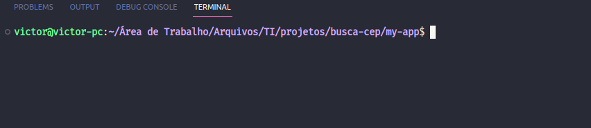

<h1>Projeto: Busca CEP</h1>

<h2>Descrição do projeto</h2>

O projeto consiste na busca de endereço atráves do CEP via API "Via CEP".

<h2>Funcionalidades do projeto</h2>

A funcionalidade do projeto consiste na busca de endereço via CEP fornecido pelo(a) usuário(a).

<h2>Tecnologias utilizadas</h2>

<ul>
    <li>React</li>
    <li>HTML</li>
    <li>CSS</li>
    <li>Javascript</li>
    <li>API Via CEP</li>
    <li>IDE utilizada: VS Code</li>
</ul>

<h2>Inicialização</h2>

1 - Instale o Node.js, caso tenha instalado pule essa etapa

2 - No terminal do VS Code (ou na IDE que você estiver utilizando), utilize o comando "git clone https://github.com/victoramos1/busca-cep" (sem aspas) caso tenha o Git instalado no computador, ou faça o download do arquivo .zip diretamente do GitHub.

3 - Com a pasta aberta na IDE (o caminho mostrado no terminal precisa levar ao projeto no seu computador, como mostrado na imagem abaixo), execute o comando "npm install" (sem aspas) no terminal da IDE.

4 - Ainda no terminal da IDE, execute o comando "npm start" (sem aspas) e aguarde uma nova aba ser aberta no seu navegador com o projeto em execução.

<h2>Status do projeto</h2>

Versão 1.0.1 finalizada.
